# LearnHub — Entity Relationship Diagram

24 tables total: **10 mandatory** (Users, Roles, UserRoles, Permissions, RolePermissions, RefreshTokens, AuditLogs, Notifications, Settings, Files) + **14 domain tables** for the e-learning platform. All tables are in 3NF with foreign keys, indexes, and audit columns (`created_by`, `updated_by`, `created_at`, `updated_at`).

> Paste this into https://mermaid.live to render, or view directly on GitHub.

```mermaid
erDiagram
    USERS ||--o{ USER_ROLES : has
    ROLES ||--o{ USER_ROLES : assigned
    ROLES ||--o{ ROLE_PERMISSIONS : grants
    PERMISSIONS ||--o{ ROLE_PERMISSIONS : in
    USERS ||--o{ REFRESH_TOKENS : owns
    USERS ||--o{ AUDIT_LOGS : performs
    USERS ||--o{ NOTIFICATIONS : receives
    USERS ||--o{ FILES : uploads

    CATEGORIES ||--o{ COURSES : contains
    USERS ||--o{ COURSES : teaches
    COURSES ||--o{ MODULES : has
    MODULES ||--o{ LESSONS : has
    COURSES ||--o{ ENROLLMENTS : enrolled_in
    USERS ||--o{ ENROLLMENTS : enrolls
    LESSONS ||--o{ LESSON_PROGRESS : tracked_by
    USERS ||--o{ LESSON_PROGRESS : progresses
    COURSES ||--o{ REVIEWS : reviewed_in
    USERS ||--o{ REVIEWS : writes
    USERS ||--o{ PAYMENTS : pays
    COURSES ||--o{ PAYMENTS : paid_for
    COURSES ||--o{ COURSE_TAGS : tagged
    TAGS ||--o{ COURSE_TAGS : tags
    CHAT_ROOMS ||--o{ CHAT_MESSAGES : contains
    USERS ||--o{ CHAT_MESSAGES : sends
    COURSES ||--o{ CERTIFICATES : certifies
    USERS ||--o{ CERTIFICATES : earns
    COURSES ||--o{ WISHLISTS : wished
    USERS ||--o{ WISHLISTS : wants

    USERS {
        int id PK
        string first_name
        string last_name
        string email UK
        string password_hash
        bool is_active
        datetime created_at
        datetime updated_at
    }
    ROLES {
        int id PK
        string name UK
        string description
    }
    USER_ROLES {
        int id PK
        int user_id FK
        int role_id FK
        datetime assigned_at
    }
    PERMISSIONS {
        int id PK
        string name UK
    }
    ROLE_PERMISSIONS {
        int id PK
        int role_id FK
        int permission_id FK
    }
    REFRESH_TOKENS {
        int id PK
        int user_id FK
        string token_hash UK
        datetime expires_at
        datetime revoked_at
    }
    AUDIT_LOGS {
        bigint id PK
        int user_id FK
        string action
        string entity
        int entity_id
        text old_value
        text new_value
        string ip_address
    }
    NOTIFICATIONS {
        int id PK
        int user_id FK
        string type
        string title
        text message
        bool is_read
    }
    SETTINGS {
        int id PK
        string key UK
        text value
    }
    FILES {
        int id PK
        string entity
        int entity_id
        string filename
        string file_path
        bigint file_size
        int uploaded_by FK
    }
    CATEGORIES {
        int id PK
        string name UK
        string slug UK
        string icon
    }
    COURSES {
        int id PK
        string title
        string slug UK
        text description
        float price
        enum level
        enum status
        int category_id FK
        int instructor_id FK
        int num_subscribers
        float avg_rating
    }
    MODULES {
        int id PK
        int course_id FK
        string title
        int order_index
    }
    LESSONS {
        int id PK
        int module_id FK
        string title
        enum type
        int order_index
    }
    ENROLLMENTS {
        int id PK
        int student_id FK
        int course_id FK
        enum status
        float progress_percent
    }
    LESSON_PROGRESS {
        int id PK
        int student_id FK
        int lesson_id FK
        bool is_completed
    }
    REVIEWS {
        int id PK
        int course_id FK
        int student_id FK
        int rating
        text comment
        bool is_approved
    }
    PAYMENTS {
        int id PK
        int user_id FK
        int course_id FK
        float amount
        enum status
        string stripe_payment_intent_id
    }
    TAGS {
        int id PK
        string name UK
    }
    COURSE_TAGS {
        int id PK
        int course_id FK
        int tag_id FK
    }
    CHAT_ROOMS {
        int id PK
        string name
    }
    CHAT_MESSAGES {
        int id PK
        int room_id FK
        int sender_id FK
        text content
    }
    CERTIFICATES {
        int id PK
        int student_id FK
        int course_id FK
        string certificate_code UK
    }
    WISHLISTS {
        int id PK
        int user_id FK
        int course_id FK
    }
```

## NoSQL usage (MongoDB + Redis)

- **MongoDB** (`app/db/nosql.py`): stores chat message history and activity event streams — flexible schema for high-write, unstructured data that doesn't need joins.
- **Redis**: caching layer for hot reads (popular courses, settings) and WebSocket presence (online user tracking).

**Justification:** relational data (users, courses, payments) needs ACID + joins → PostgreSQL. Chat logs and analytics events are append-heavy, schema-flexible, and read by recency → document store. Presence/caching is ephemeral key-value → Redis.
